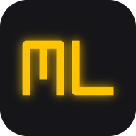
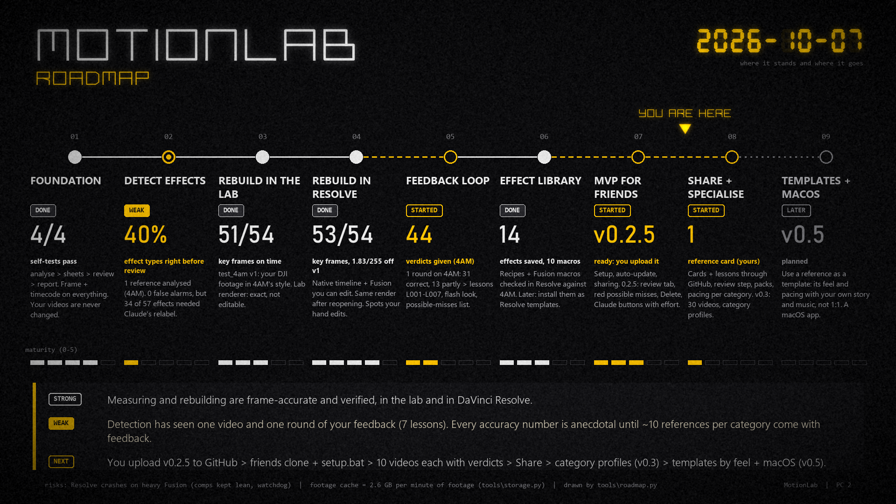

<p align="center"></p>

# MotionLab

**A local lab that takes apart the editing of any video - every cut, flash, zoom, speed ramp, split screen, text
pop and transition, frame-accurately - so you can learn its style and pacing and rebuild it with your own footage.**

Give it a reference - a music video, an Instagram reel, a cooking short, a tutorial, an ad, a motion-graphics piece,
a documentary. MotionLab measures every frame, finds the edits and effects, and shows them in a window where you scrub
frame by frame and read how each effect was made and how to rebuild it in DaVinci Resolve.
[Claude Code](https://claude.com/claude-code) looks at every effect and names it properly; you mark each one
Correct / Partly / Wrong, and the lab turns your corrections into rules.

**Built for a group of friends:** everyone runs MotionLab on their own PC with their own Claude plan and footage,
and what each install learns - reference cards with pacing and effects, and the rules from your feedback - is shared
through this GitHub repo. Analyse 10 videos each and everyone's MotionLab knows all 30.



> **Status: v0.2.5 - MVP for friends.** Detection was tuned on music videos; other categories work and get better
> with every verdict you give.

## What it does

- **Download** a reference from a link (YouTube, Vimeo, TikTok, Instagram ... via yt-dlp: MP4 up to 1080p, best
  quality, or MP3) - or drop a video into `refs\`.
- **Categorise** it: music video, ad, motion graphics, documentary, vlog, tutorial, cooking, podcast, gaming, sports,
  travel, fashion, comedy, trailer, fan edit, other - plus your own tags. The format (vertical / horizontal, length)
  is measured.
- **Analyse** it: cuts and 30+ effect types with exact frame ranges (frame number + timecode on everything), beats
  and drops, **pacing** (cuts per minute, shot lengths, cuts in the first 3 seconds, cuts on the beat), contact sheets
  and previews per effect, "possible misses".
- **Review** with Claude Code: what happens, timing and easing, camera or post, and how to rebuild it.
- **Teach it**: your verdicts in the app's review tab (and your answers on the "possible misses") -> Claude turns
  them into rules, checked by a self-test.
- **Share it**: *Knowledge > Share my knowledge* - your reference cards and new rules go to GitHub; your friends' come
  back with every update. The *Knowledge* page compares pacing and effects per category across everybody.
- **Stay current**: MotionLab updates itself from GitHub when it starts (Settings can turn that off).
- **Rebuild** (advanced, with Claude): *Recreate with my footage* edits your own clips like a reference, 1:1, as a
  lab render or as an editable DaVinci Resolve Studio project.
- **Tidy up**: *Delete* on references, downloads, your videos and renders moves them to the Windows Recycle Bin.

## Install (Windows 10 / 11)

**Recommended - with git** (needed for automatic updates and sharing):

1. Install Git once: `winget install Git.Git` (or https://git-scm.com).
2. In a terminal: `git clone https://github.com/iveltal-tekeo/MotionLab.git C:\MotionLab`
   (use this repo's address - the green *Code* button on GitHub; a private repo asks you to log in to GitHub in the
   browser once).
3. Double-click **`C:\MotionLab\setup.bat`**: Python packages, a check of the programs below (it offers to install
   missing ones and asks first), your name for sharing, a Desktop shortcut.
4. Start **MotionLab** from the shortcut (or `MotionLab.bat`). *Settings* shows what it found.

Downloaded the ZIP instead? Run `setup.bat` the same way; then *Settings > Sharing & updates > Connect to GitHub*
turns on updates and sharing.

| Program | Needed for | Get it |
|---|---|---|
| Python 3.12 (64-bit) | everything | `winget install Python.Python.3.12` or python.org (tick "Add to PATH") |
| ffmpeg | every analysis | `winget install Gyan.FFmpeg` |
| Git | updates + sharing knowledge | `winget install Git.Git` |
| Claude Code | reviews, learning from feedback, rebuilds | https://claude.com/claude-code (your own Claude plan) |
| yt-dlp | *Download from a link* (optional) | `winget install yt-dlp.yt-dlp`, or any `yt-dlp.exe` + its path in Settings |
| DaVinci Resolve Studio | rebuilding as a Resolve project (optional) | blackmagicdesign.com (Studio is paid; needed for scripting) |

Microsoft Edge (the app window) comes with Windows.

## First steps

1. **References > Download from a link** -> paste a link -> *Download* -> **Analyse it**.
2. Pick the **category** (and tags, e.g. `instagram, recipe`) and click **Analyse with Claude**: the lab measures the
   video (about 1-2 minutes per minute of video), then Claude Code opens by itself and checks every effect.
3. Open the reference: **Review effects** - Correct / Partly / Wrong (keys 1 2 3) and a note where needed - then the
   red **Possible misses** tab.
4. **Send feedback to Claude**: a new Claude Code window turns your verdicts into lessons.
5. **Knowledge > Share my knowledge.**

The References page shows these steps and where each video stands. Every frame number comes with its timecode
(`f480 (00:00:16:00)`), so you can check anything in your editor. New to Claude Code? Read
[docs/claude_tips.md](docs/claude_tips.md) (also in the app: *Tips for working with Claude*): one chat per task,
which effort level, how to use fewer tokens.

## Sharing knowledge - how it works

| What | Where | Shared? |
|---|---|---|
| Your videos, analyses, frames, contact sheets | `refs\`, `analysis\`, `projects\` | **never** |
| A **reference card** per analysed video: category, format, link, pacing, every reviewed effect + your verdict and note | `knowledge\references\` | yes |
| New **lessons** from your feedback (they work on your PC right away) | `knowledge\local\lessons.md` -> `knowledge\incoming\` | yes, reviewed first |
| Reviewed rules every MotionLab applies | `.claude\skills\analyze-reference\lessons.md` | yes |

- *Share my knowledge* commits your new cards and lessons and pushes them. Git asks you to log in to GitHub the first
  time (in the browser).
- To push, a friend needs write access: on GitHub, *Settings > Collaborators > Add people*. Friends without access
  get a pack file (`knowledge\outbox\*.mlpack.json`) to send to you; you drop it in `knowledge\inbox\` and *Import*.
- Lessons from others wait in `knowledge\incoming\` until someone reviews them (*Knowledge > Review them in Claude
  Code*), so one wrong rule cannot silently change everybody's analyser.
- Claude reads `knowledge\local\summary.md` (short: per category the pacing norms, effects seen and corrections)
  and, for the category it works on, `knowledge\local\summary\<category>.md` (every reviewed effect).

Why no cloud database: [docs/knowledge_sharing.md](docs/knowledge_sharing.md).

## For the repo owner

**First upload** (once): on github.com create a new **private** repository called `MotionLab`, without a README,
.gitignore or license (they are here already). Then in a terminal:

```
cd C:\MotionLab
git config --global user.name "your-github-name"
git config --global user.email "your-id+your-github-name@users.noreply.github.com"
git init -b main
git add .
git status
git commit -m "MotionLab 0.2.0"
git remote add origin https://github.com/your-github-name/MotionLab.git
git push -u origin main
```

The email line keeps your real email out of the history: GitHub shows your `noreply` address under *Settings >
Emails*. `git status` must list only code and docs (about 75 files) - no `refs\`, `analysis\`, `projects\`,
`library\` or `settings.json`. The first push opens a GitHub login in the browser. Then add your friends:
*Settings > Collaborators > Add people* (they accept the invitation by email), and send them the repo address.

**Publishing a new version**: change the code (with Claude), run `.venv\Scripts\python tools\selftest.py --extended`
(all PASS), raise the version in `tools\motionlab\__init__.py`, add a section to `CHANGELOG.md`, commit and push.
Every install picks it up at its next start ("MotionLab 0.2.1 is available" - or installed automatically). Push
code commits right away: *Share my knowledge* refuses to run while this copy has commits that are not on GitHub,
so it never publishes work in progress.

## Folders

| Folder | What | In the repo? |
|---|---|---|
| `tools\` | the pipeline, the app (`tools\motionlab\app\`), the Resolve builder | yes |
| `.claude\skills\` | the Claude Code skills (`analyze-reference` + the shared `lessons.md`, `recreate-video`) | yes |
| `knowledge\` | shared reference cards and lessons waiting for review (`local\`, `inbox\`, `outbox\` are private) | partly |
| `docs\` | roadmap, guides, design notes | yes |
| `refs\` | reference videos (read-only for the lab) | no - yours |
| `analysis\` | one folder per analysed video: report, events, sheets, previews, your verdicts | no - yours |
| `projects\` | your own videos and everything made for them (the app's *Videos* page) | no - yours |
| `library\` | saved effects (recipes + Fusion macros) | no - yours |
| `settings.json`, `.app\`, `.venv\` | your settings, app cache, Python packages | no |

MotionLab never modifies a source video: it only reads it and checks its SHA-256 before and after every analysis.

## Good to know

- Only download and analyse videos you are allowed to use; only text and numbers about them are shared.
- Problems: errors go to `.app\server.log`; *Settings* shows missing programs; *Check now* checks for updates.
- `CLAUDE.md` is the short guide Claude Code reads in every chat in this folder; the details are in the skills,
  `docs\` and `tools\motionlab\app\CLAUDE.md`, read only when a task needs them.

## License

MIT - see [LICENSE](LICENSE).
